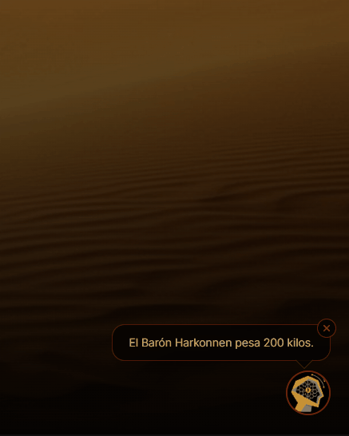
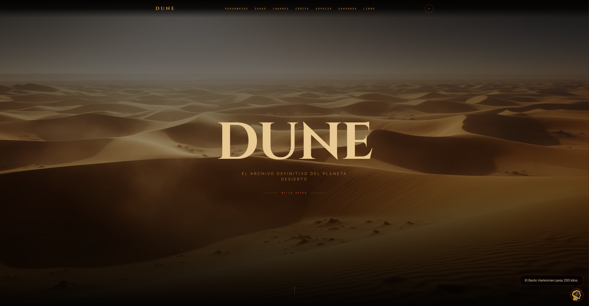
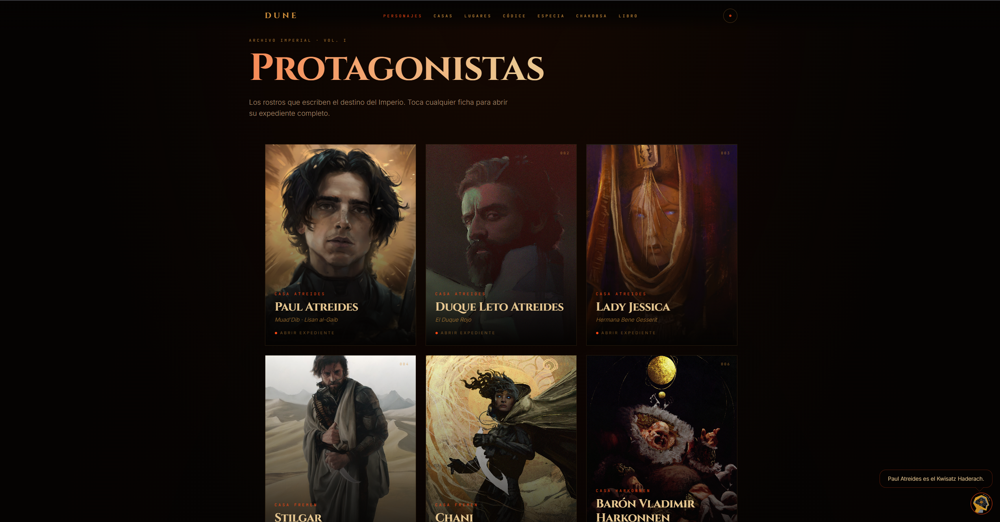
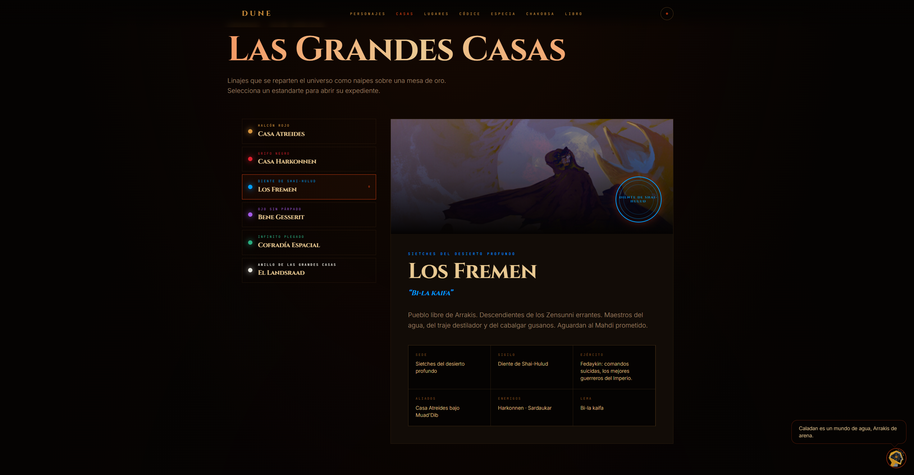
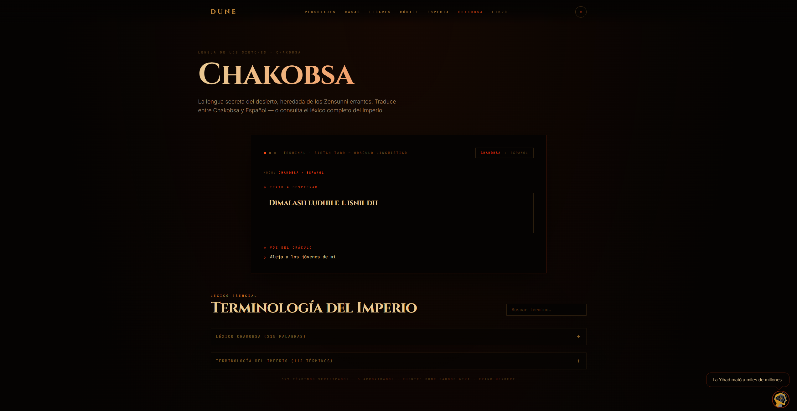

<div align="center">

# DUNE WIKI

### The Encyclopedia of the Imperium

Explora personajes, casas nobles, facciones, planetas, historia, tecnología y profecías del universo creado por Frank Herbert.

<br>


<br><br>

_"La especia debe fluir."_

</div>

---

# 🌌 Sobre el Proyecto

**DUNE Wiki** es una enciclopedia interactiva inspirada en el universo de **Dune**, diseñada para ofrecer una experiencia visual inmersiva mientras exploras la historia, personajes, organizaciones y planetas que forman parte del Imperio.

El proyecto busca centralizar información relevante del lore de Dune en una plataforma moderna, rápida y fácil de navegar, manteniendo una estética inspirada en las adaptaciones cinematográficas contemporáneas.

---

## 🧠 Mentat Imperial

Consulta información sobre el universo de Dune mediante el asistente temático inspirado en los Mentats.

<p align="center">
  
</p>

---

# ✨ Características

### 📖 Enciclopedia Interactiva

Información organizada sobre:

- Personajes
- Casas Nobles
- Facciones
- Planetas
- Tecnología
- Religión
- Historia Imperial

### 🧠 Mentat Imperial

Asistente temático capaz de responder preguntas relacionadas con:

- Personajes
- Casas
- Facciones
- Planetas
- Eventos históricos
- Conceptos importantes del universo

### 🎬 Diseño Cinematográfico

Inspirado visualmente en:

- Dune (2021)
- Dune: Part Two (2024)

Elementos visuales:

- Tonos arena
- Contrastes oscuros
- Diseño minimalista
- Estética imperial

### 📱 Responsive Design

Compatible con:

- Computadoras
- Tablets
- Dispositivos móviles

---

# 🏛️ Contenido Disponible

## 👤 Personajes

- Paul Atreides
- Lady Jessica
- Chani
- Stilgar
- Duncan Idaho
- Gurney Halleck
- Vladimir Harkonnen
- Feyd-Rautha
- Liet Kynes

---

## 👑 Casas Nobles

- Casa Atreides
- Casa Harkonnen
- Casa Corrino

---

## ⚔️ Facciones

- Fremen
- Bene Gesserit
- Mentats
- Sardaukar
- Cofradía Espacial

---

## 🌍 Planetas

- Arrakis
- Caladan
- Giedi Prime
- Salusa Secundus
- Kaitain

---

# 📸 Capturas

## Inicio

<p align="center">
  
</p>

---

## Personajes

<p align="center">
  
</p>

---

## Casas Nobles

<p align="center">
  
</p>

---

## Traductor Chakobsa

<p align="center">
  
</p>

---

# 🛠️ Tecnologías

<div align="center">

| Tecnología      | Descripción                  |
| --------------- | ---------------------------- |
| React 19        | Biblioteca de interfaces     |
| TypeScript      | Tipado estático              |
| TanStack Start  | Framework Full Stack         |
| Tailwind CSS v4 | Estilos                      |
| Bun             | Runtime y gestor de paquetes |

</div>

---

# 🚀 Instalación

## Clonar repositorio

```bash
git clone https://github.com/AramisHS/dune-wiki.git
```

## Entrar al directorio

```bash
cd dune-wiki
```

## Instalar dependencias

```bash
bun install
```

## Iniciar entorno de desarrollo

```bash
bun dev
```

---

# 📂 Estructura del Proyecto

```text
src
│
├── assets
│
├── components
│   ├── ui
│   ├── layout
│   └── sections
│
├── routes
│
├── data
│
├── hooks
│
├── lib
│
├── services
│
└── styles
```

---

# 🎯 Objetivos

- Facilitar la exploración del universo Dune.
- Reunir información relevante en una sola plataforma.
- Ofrecer una experiencia visual inspirada en las películas.
- Proporcionar una herramienta de consulta rápida mediante el Mentat Imperial.

---

# 📜 Disclaimer

Este proyecto es una iniciativa realizada por fanáticos y con fines educativos.

Dune, sus personajes, conceptos, nombres y material relacionado pertenecen a sus respectivos propietarios y titulares de derechos.

---

<div align="center">

## 🪱 SHAI-HULUD OBSERVA

_"El misterio de la vida no es un problema que resolver, sino una realidad que experimentar."_
— Frank Herbert

</div>
